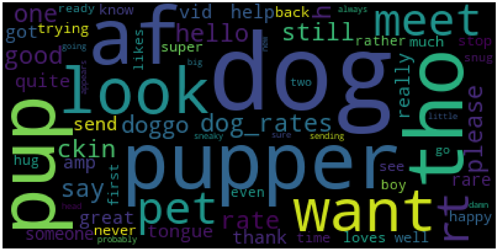

## Report: act_report

### Introduction:
The dataset that i was wrangling (and analyzing and visualizing)
is the tweet archive of Twitter user @dog_rates, also known as WeRateDogs. WeRateDogs is a Twitter
account that rates people's dogs with a humorous comment about the dog.
This project works through the data wrangling process, focusing on the gathering, assessing and cleaning
of data. There are visualization and observation from the analysis that i conducted.

### Analysis and Visualization:
I have done several analysis in this project, and those are the following:

#### histogram for favorite_count and retweet_count
+ we see in this histogram that most Favorite Count is  between 1000 to 2000

+ and for Retweet Count it's value is around 2500 or 3000.

#### wordcloud for most frequent words that appear in WeRateDogs posts.
+ the most frequent words in posts not surprisingly are `dog` `pup`, `pupper`.

#### most dog stage that was mentioned in the tweets:
+ it seems that pupper is the stage that most dogs are in, then doggo, puppo and floofer.

### Conclusion:
The write-up offers a straight look at the data wrangling process. but there is a lot of insight and information i didn't cover, for example:
+ is there a correlation between different fields of the twitter_archive ?
+ what are the trends over time ?
+ how the retweet and favorite counts vary over time ?

and the list go on and on.